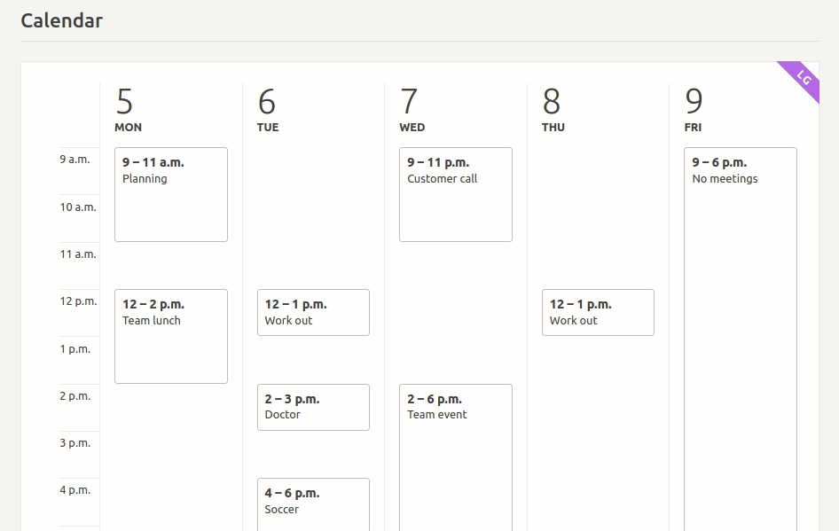

# Responsive Containers

[CSS media queries](https://developer.mozilla.org/en-US/docs/Web/CSS/Media_Queries/Using_media_queries) let us style elements based on the size of the screen. What if we wanted to style them based on the size of their **container**? A widget or block should often look different if it's full-width or constrained within a column or sidebar, but we don't have any way to write **container queries** to style those elements based on their on-screen width&hellip; or, we didn't until now!

_[Calendar demo from Philip Walton's Responsive Components demo site](https://philipwalton.github.io/responsive-components/#calendar)_

This plugin loads a small JavaScript file that conditionally applies classes to elements based on how wide those elements are in the browser. This can be used by other themes and plugins to write container-specific styles for editor blocks or widgets, so that they will display correctly wherever they're placed in the page.

The script works on the frontend and in the block editor—see your responsive styles live while you're composing your post, and trust that your widgets and blocks will look their best whether they're full-width or in the narrowest sidebar.

## How Does This Work?

The Responsive Containers plugin implements an approach popularized by [Philip Walton's excellent article _Responsive Components: a Solution to the Container Queries Problem_]. What this plugin does is apply his solution to WordPress sites so that, assuming this plugin is installed, any other plugin can opt-in to responsive container styling.

Under the hood this is all driven by [`ResizeObserver`](https://developer.mozilla.org/en-US/docs/Web/API/ResizeObserver), a new browser feature that can efficiently detect when an element changes size. We use this method to track the size of specific containers on the page and apply a set of classes to those elements based on how big they appear on the screen.

Note: **Installing and activating this plugin will not change anything about your site on its own.** You have to update your theme or plugin CSS and HTML to designate which elements you want to become responsive containers.

## License & Attribution

This plugin is licensed under the terms of the [GNU General Public License](./license.txt) (or "GPL"). It is free software; you can redistribute it and/or modify it under the terms of the GNU General Public License as published by the Free Software Foundation; either version 2 of the License, or (at your option) any later version.

It was created by K. Adam White at [Human Made](https://humanmade.com), based on a concept popularized by [Philip Walton](https://philipwalton.com/).

This plugin utilizes the [`resize-observer-polyfill` library](https://www.npmjs.com/package/resize-observer-polyfill) by Denis Rul, released under the MIT license and &copy; 2016 Denis Rul.

